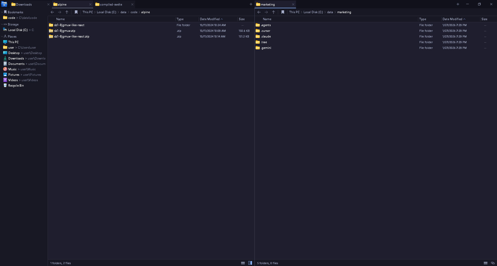

# FilePathX

A fast, keyboard-friendly Windows file manager written in pure C with OpenGL 3.3 rendering. Inspired by [File Pilot](https://filepilot.tech/).



## Features

- **Tabbed browsing** with drag-to-reorder and persistence across sessions
- **Split view** — two independent panels side by side (`Ctrl+\`), each with its own tabs, view mode and selection
- **View modes** per folder: Details, Small Icons, Large Icons (remembered via LRU cache)
- **Async thumbnails** for images and videos (worker thread, LRU cache)
- **Date grouping** in the Downloads folder (Today, Yesterday, This Week, ...)
- **Multi-select** with Shift/Ctrl, batch rename, drag-and-drop between panels
- **Inline path editor** and inline rename (`F2`)
- **Full Unicode/UTF-8** support — Cyrillic, Arabic, CJK, emoji
- **Bookmarks** sidebar with right-click remove, persisted to disk
- **Shell context menu** integration (Open, Open with, Send to, Properties, ...)
- **Recycle Bin** integrated; safe delete via `SHFileOperationW`
- **Per-monitor V2 DPI awareness** via embedded manifest
- **Dark mode** title bar through DWM
- **Custom OpenGL renderer** — dynamic glyph atlas, MDL2 icon atlas, no GDI text on the hot path

## Build

Requires the Microsoft C/C++ build tools (`cl.exe`) **or** GCC via [w64devkit](https://github.com/skeeto/w64devkit).

### MSVC

From a *Visual Studio Developer Command Prompt*:

```cmd
build.bat
```

Output: `build\FilePathX.exe`.

### GCC (w64devkit)

```bash
export PATH="/path/to/w64devkit/bin:$PATH"
windres -I src src/resource.rc -O coff -o build/resource.o
gcc -O2 -Wall -o build/FilePathX.exe \
    src/main.c src/render.c src/ui.c -Isrc build/resource.o \
    -lopengl32 -lgdi32 -luser32 -lshell32 -lshlwapi \
    -ldwmapi -lole32 -luuid -luxtheme -mwindows
```

## Keyboard shortcuts

| Shortcut | Action |
| --- | --- |
| `Ctrl+T` | New tab |
| `Ctrl+W` | Close tab |
| `Ctrl+Tab` / `Ctrl+Shift+Tab` | Next / previous tab |
| `Ctrl+\` | Toggle split view |
| `Ctrl+L` | Edit path |
| `Ctrl+D` | Open terminal in current folder |
| `F2` | Rename (works on multi-selection) |
| `Backspace` | Up one folder |
| `Enter` | Open selected |
| `Delete` | Move to Recycle Bin |
| `Shift+Delete` | Delete permanently |
| `Ctrl+A` | Select all |
| Type letters | Jump to file by prefix |

## Persistence

State is saved under `%APPDATA%\filepilot\`:

- `bookmarks.txt` — one path per line
- `tabs.txt` — active index + one path per line
- `sort.txt` — per-folder sort preference (LRU, capped at 200)
- `view.txt` — per-folder view mode (LRU)

## Architecture

- `src/main.c` — application core: Win32 message loop, COM integration, scanning, panels/tabs, all UI building
- `src/render.c` / `render.h` — OpenGL 3.3 renderer, font atlas, MDL2 icon atlas, immediate-mode quad/text/icon API
- `src/ui.c` / `ui.h` — immediate-mode widgets (tab, button, scrollbar, section header)
- `src/app.manifest` — DPI PerMonitorV2 + Windows 10/11 compatibility + long path support
- `src/resource.rc` — embeds manifest and application icon

Roughly 4 000 lines of C, no external runtime dependencies beyond stock Windows libraries.

## License

MIT
