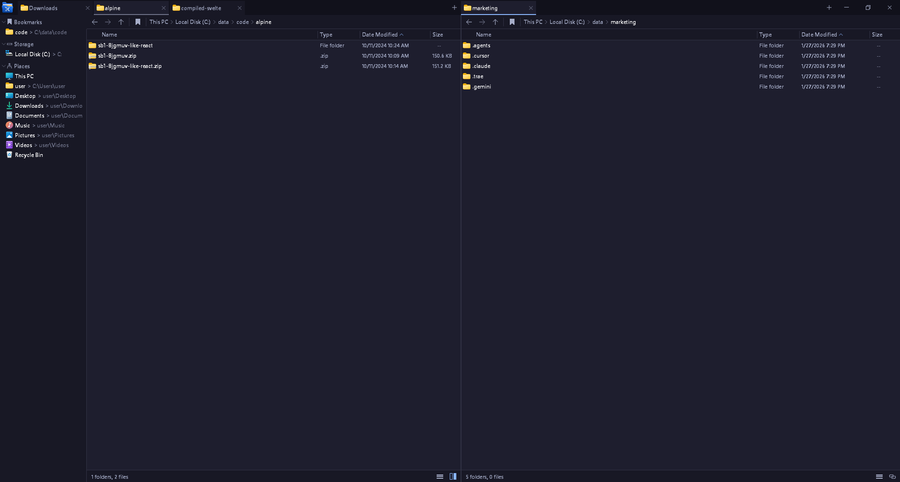

# FilePathX

A fast, keyboard-friendly Windows file manager written in pure C with OpenGL 3.3 rendering. Inspired by [File Pilot](https://filepilot.tech/).



## Features

### Browsing
- **Tabbed browsing** with drag-to-reorder; `Ctrl+T` opens a new tab pointing to the *current folder* (not "This PC"), so you can branch off your current location instantly
- **Tab and bookmark persistence** — your open tabs, active tab and bookmarks are restored on the next launch
- **Split view** — two independent panels side by side (`Ctrl+\`), each with its own tabs, view mode, selection and scroll position. Drag-and-drop works across panels
- **View modes per folder**: Details, Small Icons, Large Icons — the choice is remembered per directory via an LRU cache (capped at 200 entries)
- **Per-folder sort memory** — sort column and direction are remembered per directory (LRU, capped at 200)
- **Time grouping in the Downloads folder** — entries are bucketed into *Today*, *Yesterday*, *This Week*, *Last Week*, *This Month*, *Last Month*, *Older* headers so recent downloads are always at the top
- **Async thumbnails** for images and videos rendered on a worker thread with an LRU cache (≈ 13 MB cap), so directory listing stays responsive
- **Inline path editor** — click the breadcrumb to type a path; supports tab-completion-style navigation
- **Type-to-jump** — start typing letters in a directory to jump to the matching file or folder

### Editing
- **Multi-select** with `Shift`+click (range) and `Ctrl`+click (toggle)
- **Inline rename** with `F2`; works on a single file or as a **batch rename** across multiple selections
- **Create files & folders from the keyboard**:
  - `Ctrl+N` — new empty file
  - `Ctrl+Shift+N` — new folder
- **Drag-and-drop** between panels, between tabs, and to/from external apps (Explorer, browsers, etc.) — the cursor switches to a grab hand while dragging
- **Move to Recycle Bin** (`Delete`) or permanent delete (`Shift+Delete`) via `SHFileOperationW`
- **Same source / destination** is detected — duplicate names are auto-suffixed with ` (2)`, ` (3)`, …

### Integration
- **Shell context menu** — right-click invokes the real Windows context menu via `IContextMenu`, including *Open with*, *Send to*, *Properties*, etc. (Convert to / Rotate / Scan With are filtered out as noise)
- **Open terminal in the current folder** — `Ctrl+D` launches a terminal rooted at the focused tab's path, `Ctrl+Shift+D` adds a tab to the terminal window you already have open. Which shell it starts is picked in *Settings → General → Terminal* (see [Terminal](#terminal)), so it no longer depends on Windows Terminal's own default profile
- **Recycle Bin** entry in the sidebar opens the system Recycle Bin
- **Bookmarks** sidebar — right-click *Remove from bookmarks*; bookmarks are saved to `%APPDATA%\filepathx\bookmarks.txt`
- **File-system watcher** — directory contents auto-refresh when files are added/removed/renamed externally
- **Auto-update** — checks GitHub Releases in the background (at most once per 24 h); when a newer version exists a dot appears on the Settings button and *Settings → General → Updates* offers one-click *Install and restart*

### Rendering & platform
- **Full Unicode / UTF-8 throughout** — Cyrillic, Arabic, CJK, **emoji** (👋 🎉 🚀) all render correctly. UTF-8 is the internal encoding; wide Win32 APIs are used at every system boundary (`FindFirstFileW`, `MoveFileW`, `SHFileOperationW`, clipboard `CF_HDROP` wide format, ...)
- **Dynamic glyph atlas** — glyphs are uploaded on demand to a 1024×1024 atlas that grows as new code points appear, with a hash table for O(1) lookup
- **Per-Monitor V2 DPI awareness** via embedded manifest — sharp text and correct hit-testing on mixed-DPI multi-monitor setups
- **Dark mode** title bar through DWM (`DWMWA_USE_IMMERSIVE_DARK_MODE`)
- **Custom OpenGL 3.3 renderer** — no GDI text on the hot path; MDL2 icon atlas; all UI is drawn in immediate mode

## Build

Requires the Microsoft C/C++ build tools (`cl.exe`) **or** GCC via [w64devkit](https://github.com/skeeto/w64devkit).

### MSVC

From a *Visual Studio Developer Command Prompt*:

```cmd
build.bat
```

Output: `build\FilePathX.exe`.

### GCC (w64devkit)

```bash
export PATH="/path/to/w64devkit/bin:$PATH"
windres -I src src/resource.rc -O coff -o build/resource.o
gcc -O2 -Wall -o build/FilePathX.exe \
    src/main.c src/render.c src/ui.c src/update.c -Isrc build/resource.o \
    -lopengl32 -lgdi32 -luser32 -lshell32 -lshlwapi \
    -ldwmapi -lole32 -luuid -luxtheme -lcomctl32 -lpropsys -lwinhttp -mwindows
```

### Packaged build (portable zip + installer)

```cmd
make-installer.bat
```

Bumps nothing by itself — set `APP_VERSION` in `src/version.h` first — then
builds the stripped release exe, the portable `build\FilePathX-win64.zip`
(the asset the auto-updater downloads) and the NSIS installer
`build\FilePathX-<version>-setup.exe`. Requires NSIS 3.x on `PATH` or in
`%ProgramFiles(x86)%\NSIS`. The installer is per-user
(`%LOCALAPPDATA%\Programs\FilePathX`, no UAC) and keeps
`%APPDATA%\filepathx` (settings, tabs, themes) when uninstalled.

## Keyboard shortcuts

| Shortcut | Action |
| --- | --- |
| `Ctrl+T` | New tab in **current folder** |
| `Ctrl+W` | Close tab |
| `Ctrl+Tab` / `Ctrl+Shift+Tab` | Next / previous tab |
| `Ctrl+\` | Toggle split view |
| `Ctrl+L` | Edit path |
| `Ctrl+D` | Open terminal in current folder (shell configurable — see [Terminal](#terminal)) |
| `Ctrl+Shift+D` | New tab in the existing terminal window |
| `Ctrl+N` | New empty file |
| `Ctrl+Shift+N` | New folder |
| `F2` | Rename (works on multi-selection → batch rename) |
| `Backspace` | Up one folder |
| `Enter` | Open selected |
| `Delete` | Move to Recycle Bin |
| `Shift+Delete` | Delete permanently |
| `Ctrl+A` | Select all |
| Type letters | Jump to file by prefix |

## Persistence

State is saved under `%APPDATA%\filepathx\`:

- `bookmarks.txt` — one path per line
- `tabs.txt` — active index + one path per line
- `sort.txt` — per-folder sort preference (LRU, capped at 200)
- `view.txt` — per-folder view mode (LRU)
- `settings.ini` — theme-independent preferences (font size, row density, terminal)

## Terminal

`Ctrl+D` shells out through `wt.exe`, so without a preference the shell you get is whatever
profile Windows Terminal has set as its default — which is why the same build can open Command
Prompt on one machine and PowerShell on another. *Settings → General → Terminal* pins it:

| Chip | Launches |
| --- | --- |
| Default | Windows Terminal's own default profile (previous behaviour) |
| Command Prompt | `cmd.exe` |
| PowerShell | `powershell.exe` (Windows PowerShell 5) |
| PowerShell 7 | `pwsh.exe` |

The choice is stored as `terminal = 0..3` in `%APPDATA%\filepathx\settings.ini` and applies
immediately. If `wt.exe` is missing, the selected shell is launched directly in the folder.

For any other terminal emulator, set `terminal_cmd` (and optionally `terminal_args`, where
`{dir}` is replaced with the folder) in the same file. When `terminal_cmd` is set it overrides
the chips, which the Settings panel shows as `Custom: …`:

```ini
terminal = 1
; terminal_cmd  = wezterm.exe
; terminal_args = start --cwd "{dir}"
```

## Architecture

- `src/main.c` — application core: Win32 message loop, COM integration, scanning, panels/tabs, all UI building
- `src/render.c` / `render.h` — OpenGL 3.3 renderer, font atlas, MDL2 icon atlas, immediate-mode quad/text/icon API
- `src/ui.c` / `ui.h` — immediate-mode widgets (tab, button, scrollbar, section header)
- `src/app.manifest` — DPI PerMonitorV2 + Windows 10/11 compatibility + long path support
- `src/resource.rc` — embeds manifest and application icon

Roughly 4 000 lines of C, no external runtime dependencies beyond stock Windows libraries.

## License

MIT
